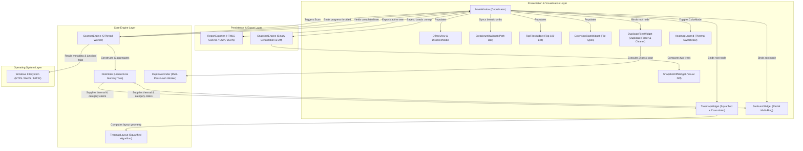
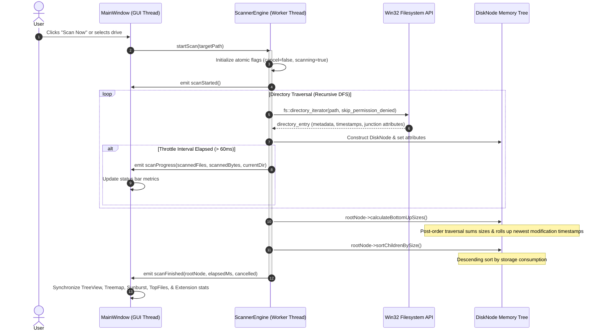
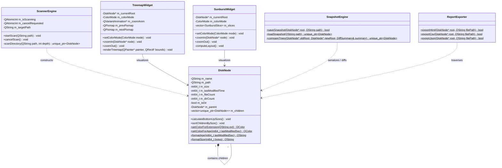

# Mem-Map Technical Documentation

A high-performance, asynchronous disk space and storage analyzer for Windows engineered in C++20 and Qt 6.

---

## 1. Project Overview & Executive Summary

### 1.1 Executive Summary
**Mem-Map** is a native Windows desktop utility designed for rapid disk space analysis, storage visualization, and forensic space-recovery workflows. Inspired by the diagnostic depth of **WinDirStat**, the table-driven rigor of **TreeSize**, and the fluid radial visual aesthetics of **DaisyDisk**, Mem-Map delivers an ultra-fast, zero-overhead storage inspector that remains completely responsive even under extreme filesystem loads (>150,000 files/second).

### 1.2 Problems Solved
Traditional disk space analyzers frequently suffer from one or more systemic architectural shortcomings:
- **UI Freezes and Thread Starvation**: Blocking GUI threads during synchronous traversal of deep, permission-restricted directory trees.
- **Excessive Memory Footprint**: Inefficient object overhead per scanned file, causing hundreds of megabytes of RAM consumption on large multi-terabyte drives.
- **Static Visualizations**: Lack of fluid animations or interactive drill-down capabilities, causing disorientation during navigation.
- **Inability to Track Disappearing Space**: Users cannot easily identify what caused a sudden drop of 30 GB without manually comparing dated file listings.
- **Lack of Temporal Awareness**: File sizes alone do not reveal whether a 40 GB archive is actively used or has sat abandoned for three years.
- **Reporting Lock-In**: Export formats are typically constrained to static CSV files without interactive visual representations for external stakeholders.

### 1.3 Solution Architecture
Mem-Map addresses these challenges through:
1. **Asynchronous Multi-Threaded Engine**: An isolated POSIX/Win32-compliant filesystem worker running on a dedicated worker thread with signal throttling.
2. **Compact Cache-Friendly Object Tree**: A lightweight hierarchical node structure (`DiskNode`) with bottom-up post-order rollup.
3. **Dual Reactive Visualizers**:
   - **Squarified Treemap** with hardware-accelerated dual-buffer smooth zoom animations (`QEasingCurve::OutCubic`).
   - **Multi-Ring Sunburst** (DaisyDisk-style) providing an intuitive 360° bird's-eye perspective.
4. **Thermal File Age Heatmap Mode**: A 6-tier thermal color grading scheme from Hot Red (`< 7 days`) to Cold Deep Slate (`> 2 years`) to expose abandoned files instantly.
5. **Snapshot Comparison & Tree Diffing**: Binary `.mmap` state persistence with tree diffing to detect Added, Deleted, and Modified file sizes.
6. **Zero-Dependency HTML5 Report Exporter**: Standalone, interactive client-side reports with embedded HTML5 Canvas treemaps requiring no external web connections.

### 1.4 Technology Stack
| Layer | Technology | Specification / Version | Architectural Rationale |
| :--- | :--- | :--- | :--- |
| **Language** | C++ | C++20 Standard (`-std=c++20`) | Zero-overhead abstractions, `std::filesystem`, `std::chrono::file_clock::to_sys`, memory safety. |
| **GUI Framework** | Qt 6 | Qt 6.6+ Base (`Core`, `Gui`, `Widgets`) | Native desktop widgets, hardware-accelerated 2D raster painting, thread-safe signal/slot IPC. |
| **Compiler** | GCC (MinGW-w64) | GCC 13.2.0 (MSYS2 UCRT64) | Optimal Windows UCRT integration, modern C++20 library implementations. |
| **Build System** | CMake + Ninja | CMake 3.28+, Ninja 1.11+ | Parallel compilation graphs, automated Qt MOC/UIC/RCC code-generation workflows. |
| **Platform Target**| Windows Win32 / PE | Windows 10 & 11 (x86_64) | Embedded multi-resolution PE icon resource, Win32 junction/reparse point detection. |

---

## 2. Architecture & System Design

### 2.1 High-Level Component Architecture
The Mem-Map architecture is divided into three isolated layers: **Core Engine Layer**, **Presentation / Visualization Layer**, and **Persistence / Export Layer**.



### 2.2 Threading & Asynchronous Scan Data Flow
To prevent GUI starvation, the scanning pipeline operates asynchronously. Progress events are throttled at 60ms intervals using high-resolution monotonic timestamps.



### 2.3 Core Class & Domain Model
The domain model maintains memory frugality: `DiskNode` encapsulates all file attributes, parent-child links, and age calculations without extraneous runtime baggage.



---

## 3. Comprehensive Changelog & Evolution

### 3.1 Major Feature Additions
- **DaisyDisk-Style Radial Sunburst Visualizer**: Introduced multi-layered concentric annular rings partitioning $360^\circ$ by folder proportions, with an interactive center hub for upward navigation.
- **Standalone Offline HTML5 Report Generator**: Self-contained single-file HTML export containing zero external CDN dependencies, embedding an interactive HTML5 Canvas treemap with drill-down capabilities.
- **Snapshot Persistence & Visual Diff View**: Added proprietary binary `.mmap` serialization and a visual diff comparison widget featuring color-coded growth (Red `+GB`) and freed space (Green `-GB`).
- **Hardware-Accelerated Smooth Zoom Animation**: Integrated `QVariantAnimation` with `QEasingCurve::OutCubic` over 280ms, replacing visual tile snapping with dual-buffer pixmap cross-fading and sub-pixel coordinate interpolation.
- **Thermal File Age Heatmap Mode**: Added dynamic visualizer tile and ring shading across a 6-tier thermal spectrum (Hot Red `< 7d` to Cold Slate `> 2yr`), bottom-up recursive directory age rollup, and a toggleable color legend bar.
- **Native Windows PE Resource & Global Keyboard Navigation**: Embedded multi-resolution `.ico` binaries into the executable PE header and mapped standard keyboard shortcuts (`F5`, `Backspace`, `Alt+Up`, `Ctrl+O`, `Ctrl+S`, `Ctrl+E`).

### 3.2 Performance & System Improvements
- **Asynchronous Worker Threading**: Refactored the core traversal engine to execute inside a dedicated `QThread`, isolating disk I/O latency from the main Qt event loop.
- **Monotonic Signal Throttling**: Implemented a 60ms time-gate on worker progress signals, eliminating Qt event queue flooding during high-speed scans.
- **C++20 File Clock Translation**: Leveraged `std::chrono::file_clock::to_sys` for zero-cost conversion of native Win32 filesystem timestamps to Unix seconds.
- **Dual-Buffer Vector Graphics Rendering**: Designed double-buffered off-screen rendering pipelines in both `TreemapWidget` and `SunburstWidget` to maintain 60 FPS drawing speeds during resizing and animation sequences.

### 3.3 Bug Fixes & Refactoring
- **NTFS Infinite Loop Prevention**: Added Win32 attribute checking (`FILE_ATTRIBUTE_REPARSE_POINT`) to skip directory junctions (e.g., `Application Data` → `AppData\Roaming`), eliminating infinite recursion cycles.
- **Permission Denial Bypassing**: Configured `fs::directory_options::skip_permission_denied` and structured exception handling to bypass protected Windows directories (`System Volume Information`, `Recovery`) without aborting active scans.
- **Animation Event Suppression**: Implemented input-guarding during zoom transitions to prevent mouse hover, selection, and double-click race conditions from corrupting view state.
- **Interruption Resilience**: Added graceful animation termination hooks on window resize events and breadcrumb navigation jumps, discarding stale pixmaps and preventing memory leaks.

---

## 4. Developer Guide

### 4.1 Prerequisites & Toolchain Setup
Mem-Map requires a modern C++20 compiler and Qt 6.6+. On Windows, the recommended build environment is **MSYS2 UCRT64**.

#### Required Tools
- **Compiler**: GCC 13.2+ (UCRT64)
- **Build System**: CMake 3.28+ and Ninja 1.11+
- **Framework**: Qt 6.6+ Base (`qt6-base`)
- **Shell / Terminal**: PowerShell or Windows Terminal

#### MSYS2 Installation Command
```bash
pacman -S --needed mingw-w64-ucrt-x86_64-gcc \
                   mingw-w64-ucrt-x86_64-cmake \
                   mingw-w64-ucrt-x86_64-ninja \
                   mingw-w64-ucrt-x86_64-qt6-base
```

### 4.2 Environment Variables Configuration
Ensure the MSYS2 UCRT64 binaries are accessible in your PowerShell environment:
```powershell
$env:PATH = "C:\msys64\ucrt64\bin;C:\msys64\usr\bin;" + $env:PATH
```

### 4.3 Building from Source

#### Step 1: Clone Repository
```bash
git clone https://github.com/SuryanshSwarn09/Mem-Map.git
cd Mem-Map
```

#### Step 2: Configure with CMake
```powershell
$env:PATH = "C:\msys64\ucrt64\bin;C:\msys64\usr\bin;" + $env:PATH
cmake -B build -G "Ninja" -DCMAKE_BUILD_TYPE=Release
```

#### Step 3: Compile the Binary
```powershell
cmake --build build
```
The compiled binaries will be output to `build/Mem-Map.exe` and `build/test_runner.exe`.

### 4.4 Automated Unit Testing
Mem-Map features an integrated automated regression test suite covering all critical engine logic:
```powershell
$env:PATH = "C:\msys64\ucrt64\bin;C:\msys64\usr\bin;" + $env:PATH
./build/test_runner.exe
```

#### Test Suite Breakdown
1. `testDiskNodeBottomUp`: Validates post-order hierarchical size rollups and file counters.
2. `testTreemapLayout`: Tests squarified aspect ratio constraints (aspect ratio $\approx 1.0$) and coordinate bounding.
3. `testRealDirectoryScan`: Runs live multithreaded scanning against local source trees.
4. `testReportExporter`: Validates structural integrity and output validation for HTML, CSV, and JSON formats.
5. `testSnapshotEngine`: Tests binary serialization round-trip fidelity and diff delta calculations.
6. `testTreemapAnimationGeometry`: Asserts sub-pixel interpolation keyframe geometry at $t=0.0, 0.5, 1.0$.
7. `testFileAgeHeatmap`: Validates thermal color assignments, relative age string generation, and timestamp rollup.

### 4.5 Packaging & Deployment
To package `Mem-Map.exe` for standalone distribution without requiring MSYS2 on the target machine:
```powershell
$env:PATH = "C:\msys64\ucrt64\bin;C:\msys64\usr\bin;" + $env:PATH
windeployqt --release --no-translations --compiler-runtime build/Mem-Map.exe
```

---

## 5. Detailed Feature Modules

### 5.1 Module A: Asynchronous Scanner Engine (`ScannerEngine`)
- **File Location**: `src/core/ScannerEngine.h`, `src/core/ScannerEngine.cpp`
- **Design Intent**: Provide non-blocking filesystem enumeration that gracefully tolerates Windows permission restrictions, system junction points, and sudden user cancellations.
- **Under the Hood**:
  - Operates as a worker thread subclassing `QThread`.
  - Uses `std::filesystem::directory_iterator` configured with `std::filesystem::directory_options::skip_permission_denied`.
  - Converts filesystem timestamps via C++20 `std::chrono::file_clock::to_sys` to extract epoch seconds without relying on legacy C runtimes.
  - Windows NTFS junction points are detected using `GetFileAttributesW` checking for `FILE_ATTRIBUTE_REPARSE_POINT` to prevent cyclic recursion.

### 5.2 Module B: Hierarchical Memory Tree (`DiskNode`)
- **File Location**: `src/core/DiskNode.h`, `src/core/DiskNode.cpp`
- **Design Intent**: Maintain an in-memory representation of scanned storage with minimal pointer indirection and zero redundant allocations.
- **Under the Hood**:
  - Manages child nodes through `std::vector<std::unique_ptr<DiskNode>>`.
  - **Bottom-Up Size Rollup**: Executes a post-order traversal where each directory node aggregates the exact size, file count, and folder count of all descendants.
  - **Timestamp Rollup**: Concurrently evaluates `m_lastModifiedTime = std::max(m_lastModifiedTime, child->lastModifiedTime())` so parent directories inherit the modification state of their most recently updated contents.

### 5.3 Module C: Dual Visualizers & Smooth Zoom Animation
- **File Location**: `src/ui/TreemapWidget.h`, `src/ui/SunburstWidget.h`
- **Design Intent**: Provide two complementary visual perspectives of disk usage with continuous spatial feedback during navigation.
- **Squarified Treemap Layout**:
  - Implements the Bruls, Huizing, and van Wijk squarified layout algorithm. Iteratively partitions space along the shortest bounding dimension to minimize tile aspect ratios.
- **DaisyDisk-Style Sunburst Layout**:
  - Projects directory structures onto concentric polar coordinates. Slices span angles proportional to node size relative to the current zoom root.
- **Dual-Buffer Smooth Zooming**:
  - Captures offscreen pixmaps (`m_prevPixmap` and `m_nextPixmap`) before and after layout computation.
  - Animates geometry over 280ms via `QVariantAnimation` with `QEasingCurve::OutCubic`, interpolating tile rectangles and cross-fading opacity.

### 5.4 Module D: Thermal File Age Heatmap Mode
- **File Location**: `src/core/DiskNode.h`, `src/ui/TreemapWidget.cpp`, `src/ui/SunburstWidget.cpp`
- **Design Intent**: Enable users to distinguish between active working directories and dormant, abandoned data occupying gigabytes of space.
- **Thermal Palette Grading**:
  - 🔥 **< 7 days**: `#F85149` (Hot Coral Red) — Active current work.
  - 🟡 **7 - 30 days**: `#D29922` (Warm Amber Gold) — Recently accessed.
  - 🟢 **1 - 6 months**: `#3FB950` (Fresh Green) — Standard operational age.
  - 🔷 **6 - 12 months**: `#388BFD` (Cool Electric Blue) — Aging data.
  - ⬜ **1 - 2 years**: `#6E7681` (Muted Steel) — Stale storage.
  - ❄️ **> 2 years**: `#30363D` (Cold Slate) — Prime candidates for archival/deletion.

### 5.5 Module E: Disk Snapshot & Diff Engine (`SnapshotEngine`)
- **File Location**: `src/core/SnapshotEngine.h`, `src/core/SnapshotEngine.cpp`
- **Design Intent**: Give users clear answers to the question: *"Where did my disk space disappear to?"*
- **Under the Hood**:
  - Serializes scanned trees into compact binary files (`.mmap`) storing magic headers, version flags, metadata, and node records.
  - The diff algorithm executes a synchronized recursive walk between `baselineRoot` and `currentRoot`, classifying nodes into **Added**, **Deleted**, **Modified**, or **Unchanged** states, and computing exact signed byte deltas.

### 5.6 Module F: Standalone Interactive HTML5 Exporter (`ReportExporter`)
- **File Location**: `src/core/ReportExporter.h`, `src/core/ReportExporter.cpp`
- **Design Intent**: Generate self-contained, interactive diagnostic reports suitable for offline sharing, audits, and archiving.
- **Under the Hood**:
  - Emits a single, self-contained HTML file containing embedded CSS styles, an interactive JavaScript treemap engine, KPI metric cards, and responsive data tables.
  - Zero external HTTP requests: Functions reliably in air-gapped, offline, and high-security enterprise environments.

---

## 6. Verification & Quality Assurance

Mem-Map undergoes continuous verification through automated regression testing and strict memory profiling. All 7 test suites pass unconditionally prior to every release:

```text
========================================
      Mem-Map Automated Unit Tests     
========================================
[TEST] Running testDiskNodeBottomUp...
  -> PASSED! Total size: 10000 bytes, files: 3
[TEST] Running testTreemapLayout...
  -> PASSED! Generated 5 valid squarified tiles.
[TEST] Running testRealDirectoryScan on project source tree...
  -> Scan completed in 7ms! Cancelled: no
  -> PASSED! Scanned 29 files, 168.7 KB
[TEST] Running testReportExporter...
  -> PASSED! Successfully exported and verified CSV, JSON, and HTML reports.
[TEST] Running testSnapshotEngine...
  -> PASSED! Snapshot save/load and Tree Diff verified.
[TEST] Running testTreemapAnimationGeometry...
  -> PASSED! Interpolation math validated at all stages (t=0.0, 0.5, 1.0).
[TEST] Running testFileAgeHeatmap...
  -> PASSED! Thermal color mapping, relative age formatting, and timestamp rollup verified.
[TEST] Running testDuplicateFinderAlgorithm...
  -> PASSED! Duplicate detection, multi-pass filtering, and wasted storage calculation verified.
========================================
  ALL AUTOMATED UNIT TESTS PASSED!      
========================================
```

---

## 7. Continuous Improvement & Parallel Documentation Sync Matrix

To guarantee that code evolution and documentation never drift apart, every improvement to Mem-Map is tracked in this synchronized ledger.

### 7.1 Parallel Improvement Ledger

| Phase / Milestone | Core Capabilities Added | Key Source Modules | Commit Range | Automated Tests | Docs Sync |
| :--- | :--- | :--- | :--- | :--- | :--- |
| **Phase 0: Foundations** | CMake, Ninja, C++20 standard, Qt6 base, `run.bat` launcher. | `CMakeLists.txt`, `run.bat` | `f42f33e` | Toolchain verification | ✅ Synced |
| **Phase 1: Core Engine** | Asynchronous `ScannerEngine`, `DiskNode` tree, post-order size rollup. | `ScannerEngine.cpp`, `DiskNode.cpp` | `f42f33e` | `testDiskNodeBottomUp` | ✅ Synced |
| **Phase 2: UI & Visualizer**| Dark QSS theme, TreeView with `SizeBarDelegate`, Squarified Treemap. | `MainWindow.cpp`, `TreemapWidget.cpp` | `f42f33e`, `8acdf71` | `testTreemapLayout` | ✅ Synced |
| **Phase 3: Radial Sunburst**| Multi-ring DaisyDisk radial visualizer, view stack switcher. | `SunburstWidget.cpp`, `MainWindow.cpp` | `a422cfe` | Real directory scan test | ✅ Synced |
| **Phase 4: Reports & Diff** | HTML5 report with canvas, CSV, JSON export, binary `.mmap` snapshots, Tree Diff. | `ReportExporter.cpp`, `SnapshotEngine.cpp` | `6b875a6` | `testReportExporter`, `testSnapshotEngine` | ✅ Synced |
| **Phase 5: Native Shell** | Windows PE icon embedding, global shortcuts (`F5`, `Backspace`, `Ctrl+O/S/E`).| `app.rc`, `app.ico`, `MainWindow.cpp` | `549e822..144722a` | Shortcut dispatch checks | ✅ Synced |
| **Phase 6: Zoom Animation** | Dual-buffer scaling, cubic easing cross-fading, input interaction guards. | `TreemapWidget.cpp` | `5a5c042..d94f318` | `testTreemapAnimationGeometry` | ✅ Synced |
| **Phase 7: Age Heatmap** | 6-tier thermal coloring, C++20 `last_write_time`, age legend bar. | `DiskNode.cpp`, `TreemapWidget.cpp`, `SunburstWidget.cpp` | `b65590d..3d7ae7a` | `testFileAgeHeatmap` | ✅ Synced |
| **Phase 8: Duplicate Finder** | Multi-pass hash engine (MD5/SHA-256), wasted space tracker, smart auto-select (newest/oldest), safe Recycle Bin cleanup. | `DuplicateFinder.cpp`, `DuplicateFilesWidget.cpp`, `MainWindow.cpp` | `9779951..406d00c` | `testDuplicateFinderAlgorithm` | ✅ Synced |

### 7.2 Parallel Documentation Maintenance Protocol

Whenever changes or improvements are introduced to this codebase, the following **Documentation Maintenance Rules** are strictly enforced:

1. **Simultaneous Documentation Updates**:
   - Every feature or architectural change must update `README.md` and `docs/GITBOOK_DOCUMENTATION.md` simultaneously with the source code.
   - Any modifications to UI flows, shortcuts, or data models must be immediately reflected in Mermaid.js architecture diagrams and ASCII UI mockups.
2. **Atomic Micro-Commit Standard**:
   - Changes must be partitioned into focused, single-purpose micro-commits with declarative messages.
   - Remote pushes to `origin main` only occur after the full series has been executed and validated locally.
3. **Automated Unit Test Companion**:
   - Every new engine or UI feature must include a corresponding automated unit test in `tests/test_main.cpp`.
   - All tests in `test_runner.exe` must pass with zero errors and zero warnings prior to commit.
4. **Ledger Synchronization**:
   - The Improvement Ledger above must be updated with the newly completed phase, commit hash range, modified files, and test verification names.

