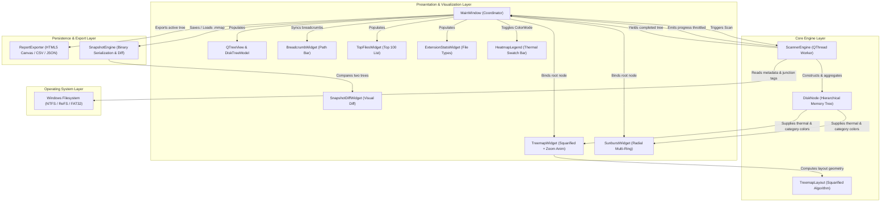
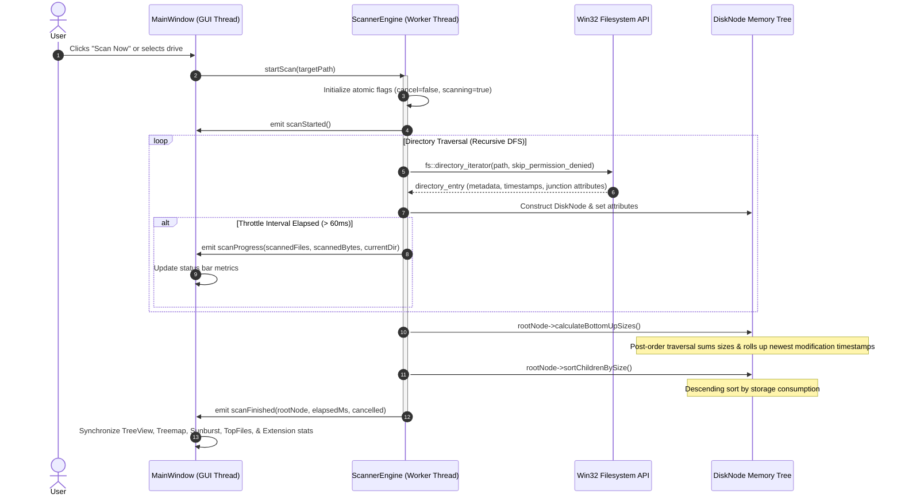
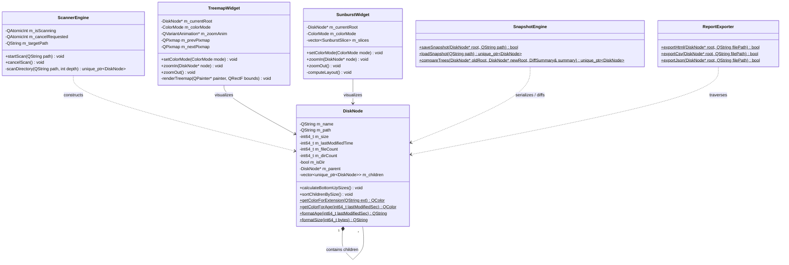

# Architecture & System Design

Mem-Map is engineered around a clean three-tier separation of concerns: **Core Engine**, **Presentation / Visualizers**, and **Persistence / Reporting**.

---

## 1. High-Level Component Architecture

---

## 2. Threading & Asynchronous Scan Data Flow

To eliminate UI freezes and starvation, filesystem traversal runs on a dedicated worker thread, dispatching throttled telemetry back to the GUI thread at 60ms intervals.

---

## 3. Core Class & Domain Model

